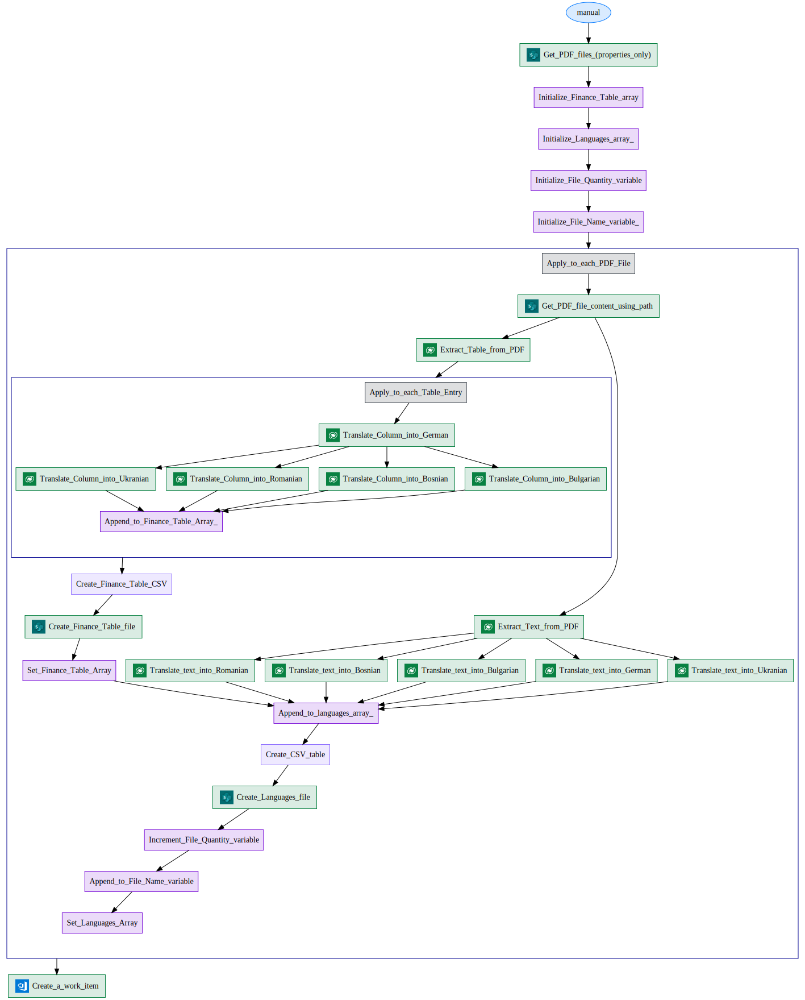
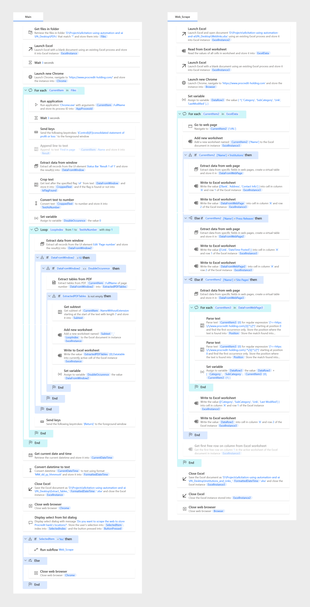

# elicitation-using-automation-and-ai  

## Power Automate Cloud
### Project Overview
This project was made on the quarterly financial reports released by the ProCredit Holding group on their website.
The main goal here was to design a use case involving Microsft and Azure solutions i.e. Power Platform and AI Builder.

Project Demonstration Video: https://drive.google.com/file/d/1DGkdSPhIYVD8KbfD3Y13AsbJXgIlO_Od/view?usp=drive_link

### Project Description
<ul>
  <li>The 6 PDF files present in the folder '.PDFs\Train' were used to train the AI models 'Extract custom information from the document' (this model uses Azure Form Recognizer neural model under the hood) to extract 'Consolidated statement of profit or loss' table and 'Course of business operations' text paragraph.</li>
  <li>Another pre-trained AI model for Text translation was used to translate the information extracted in English from the previous step to some of the main languages of the countries where the ProCredit Group operates i.e. German, Ukrainian, Romanian, Bosnian, Bulgarian.</li>
  <li>The whole process of picking up the PDF files then running the AI models on it and finally saving the results as CSVs was automated using Power Automate.</li>
  <li>Azure Board was also integrated into the Power Automate flow to create a Work Item with the necessary parameters whenever the flow gets executed.</li>
  <li>The flow was tested on the 3 files present in the folder '.PDFs\Test' and the subsequent 6 CSVs generated (1 for the table and 1 for the text paragraph per PDF) are present in the folder '.CSVs'.</li>
  <li>The automation flow is present inside the folder 'Power Automate' in the zipped and unzipped format.</li>
  <li>After performing some ETL operations in Power Query on the CSVs extracted, they were then visualized in PowerBI (ProCredit Dashboard.pbix).</li>
  <li>The documentation of the flow was generated in PowerDocu (technical documentation tool for Power Automate flows and Power Apps canvas apps) that is present in the folder 'Documentation'.</li>
  <li>Project Outline.pdf contains a summary presentation of the project.</li>
</ul>

## Power Automate Desktop
### Project Overview

